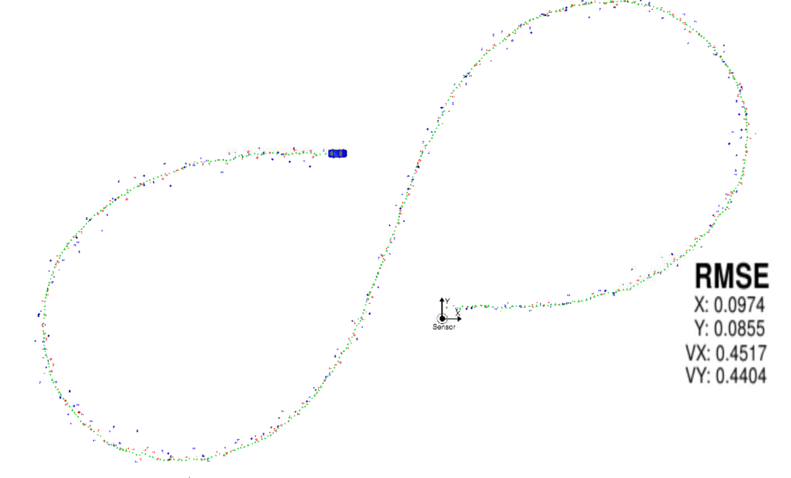
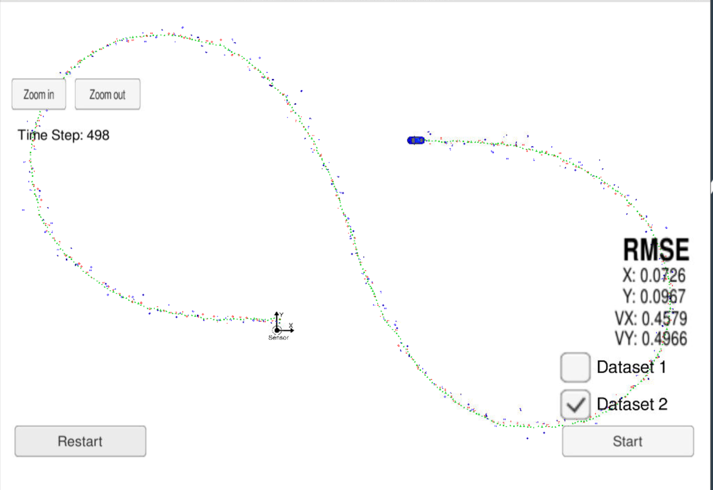
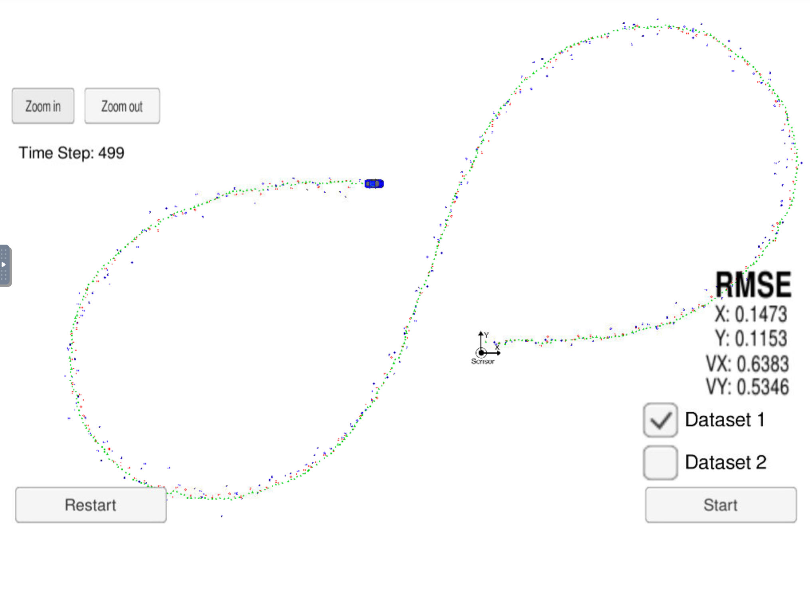
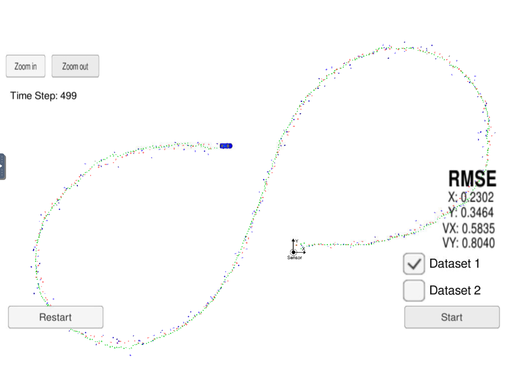

# Extended Kalman Filter Project 
Self-Driving Car Engineer Nanodegree Program

This project implements Kalman filter to estimate state of moving object based on noisy lidar and radar measurements.

To test run, use the Term 2 Simulator which can be downloaded [here](https://github.com/udacity/self-driving-car-sim/releases).

## Install and run
First, install all required dependencies, run the `install-[linux|mac|ubuntu].sh` based on your OS.

After that, prepare Makefile:
```shell script
mkdir build
cd build
cmake ..
```

When done, run `make` do build the project and `./ExtendedKF` to run.
Run the simulator to see the results.


## Results
Using both Lidar and Radar measurements, we get a smooth curve. The RMSE achieved are:

() | Dataset 1 | Dataset 2
:---:|:---:|:---:
x | 0.0974 | 0.0726
x | 0.0855 | 0.0967
vx | 0.4517 | 0.4579
vy | 0.4404 | 0.4966

Dataset 1 | Dataset 2
--- | ---
 | 


### Single sensor only measurements

Laser | Radar 
--- | ---
 | 
x: 0.1473  | x: 0.2303
y: 0.1153 | y: 0.3464
vx: 0.6383 | vx: 0.5835
vy: 0.5346 | vy: 0.8040

As expected, single sensor measurements gives much higher error than when combined. Lidar provides much better spatial resolution, which is visible in lower x/y errors. Radar provides direct velocity measurements, although quite surprisingly the vs/vy error are pretty high. This could be to non-linear nature of the way our car moves.

When using Sensor Fusion, the overall error is _lower_ than one from any single sensor. This is true for all dimensions (x, y, vx, vy). This is a great finding as we can get accurate data having multiple noisy sensors.   
